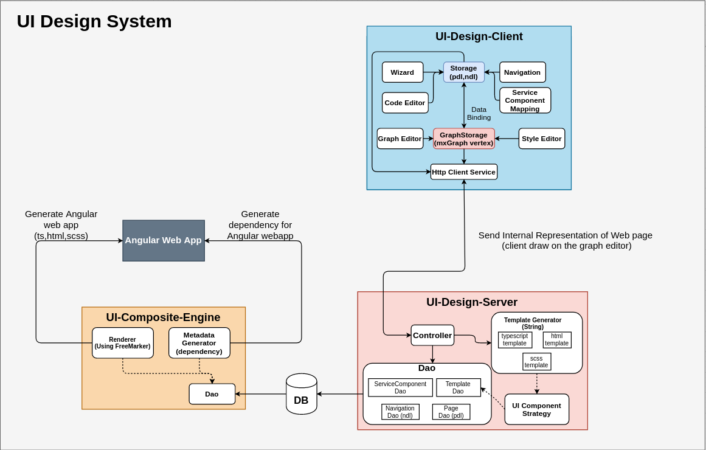
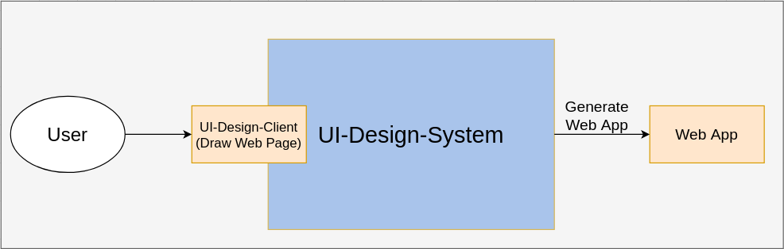
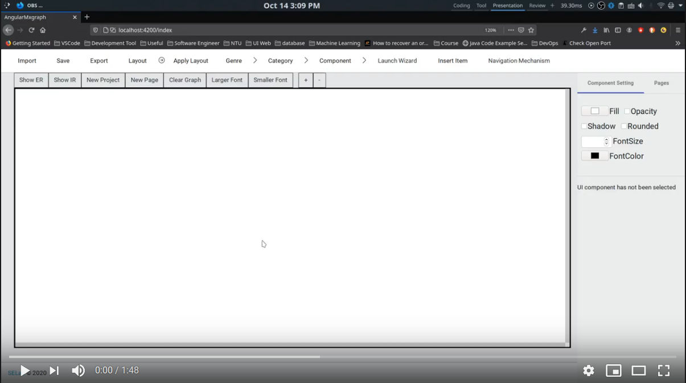

# UI-Design-System
## System Architecture

***
## Requirement

###### Users draw web page using UI-Design-Client -> UI-Design-System -> Web App(Angular)
***
## This Repository consists of three projects(UI-Design-Client, UI-Design-Server, UI-Composition-Engine)
* UI-Design-Client: let users draw their desire web page(using mxGraph library)
    * Angular Project 
    * Using MxGraph Library to draw vertex and graph

* UI-Design-Sever save the internal rerentation of web into database
    * SpringBoot Project

* UI-Composition-Engine get data(UI-Design-Sever save before) and using template engine(FreeMarker) compose Angular web app
    * Java(Gradle Project)
    * Using FreeMarker template engine
    

